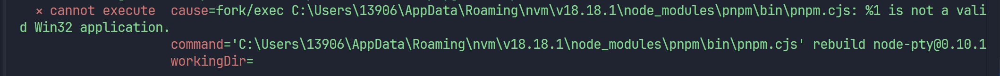

# 超级大坑

当你满心欢喜使用了`pnpm i`安装好了依赖，一定报错，请按照如下方法修复

- electron 修复：https://github.com/pangxieju/electron-fix
- mac 配置修改：

```
"postinstall": "electron-rebuild -f -w node-pty --arch=arm64"
"mac": {
      "target": "dir",
      "arch": [
        "arm64"
      ]
    }
```

- windows:

# 🛠️ Windows 下 `node-pty` 依赖安装解决方案 

<span style="color: #3498db; font-weight: 600;">⚠️ 注意：</span> 
本方案适用于 Windows 10/11 环境

# 🚀 下载 Visual Studio Installer

## 1. [官网下载地址](https://visualstudio.microsoft.com/zh-hans/downloads/)

## 2. 修改安装位置

* &#x20;如果不是首次安装vs，会碰到共享组件无法选择安装位置的问题，解决方法如下：

* 快捷键 WIN + r 打开注册表：更改注册表 HKEY\_LOCAL\_MACHINE\SOFTWARE\Microsoft\VisualStudio\Setup下的SharedInstallationPath项为所要的路径。或者直接删除

* 修改或者删除这个默认路径（这里可以修改为其他盘的安装位置）
   -example: D:\software\Microsoft\VisualStudio\Shared

## 3. 安装配置
  - ☑️ C++桌面开发选项
  - ☑️ python开发环境
  - ☑️ (Python 3 64-bit)
  - ☑️ MSVC v142或者更新版本 (VS工具安装界面--单个组件--搜索MSVC)
  - ☑️ 自带的CMake

## 4. 配置python环境

* &#x20;在Path环境变量里，添加python.exe路径和pip.exe路径

* 验证python环境
```bash
    python --V
    pip --V
```

## 5. 安装依赖（建议使用稳定的node版本）
* 删除原先的node_modules
  ```bash
    rm -rf node_modules
    pnpm install
  ```
* 如果碰到对等依赖问题
  ```bash
    pnpm install --legacy-peer-deps
  ```

## 6. pnpm install 最后可能遇到的报错

  - 解决方案： (找到pnpm中的pnpm.cjs,由于使用的nvm管理，这里以18.18.1 node版本为例)
  ### 🛠️ 1、查看nvm路径:
  - ```bash
    nvm root
    
  ### 🛠️ 2、找到这个文件：
  - C:\Users\13906\AppData\Roaming\nvm\v18.18.1\node_modules\pnpm\bin\pnpm.cjs
    <span style="color: #3498db; font-weight: 600;">⚠️ 注意：</span> ：nvm前面的地址以你实际本机nvm的具体路径为主件
  
  ###  🛠️ 3、修改文件第一行代码内容:
    --原先内容：#!/usr/bin/env node
    --修改后：#!node