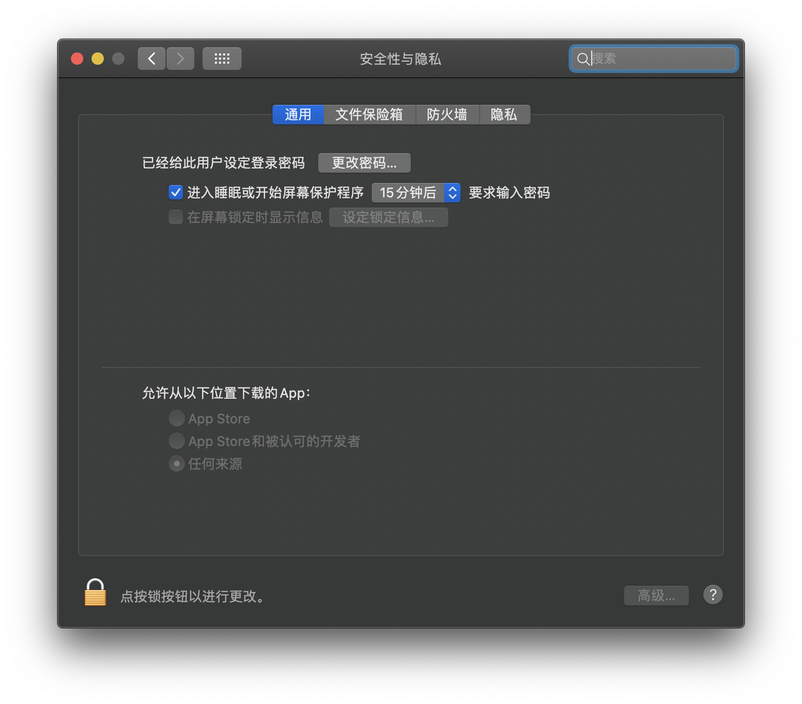

[](https://github.com/we0-dev/we0/blob/main/README.md) [](https://github.com/we0-dev/we0/blob/main/docs/README.zh.md) 


# we0

## 什么是 We0


## we0 有什么不同之处？

目前 cursor 、v0、bolt.new 在 web 项目生成有比较惊艳的表现。we0 项目有以下特点

- 支持浏览器运行调试，内置 webContainer 环境可以让你在浏览器环境下运行终端，安装并运行 npm 和工具库
- 还原高保真设计图，运用行业前沿的 D2C 技术，支持 90%设计稿还原。
- 支持历史项目引入，相较于 bolt.new 它运行在浏览器的环境下。we0 能够直接打开现有的历史项目，进行二次编辑和调试
- 打通微信小程序开发者工具，能够直接通过点击预览吊起微信开发者工具并进行调试。
- 多端支持 支持了 windows,mac 操作系统客户端下载，以及 web 容器运行场景，可以根据使用场景选用不同的终端

| 功能                   | we0 | v0  | bolt.new |
| ---------------------- | --- | --- | -------- |
| 代码生成和预览         | ✅  | ✅  | ✅       |
| 设计稿转代码           | ✅  | ✅  | ❌       |
| 开源                   | ✅  | ❌  | ✅       |
| 支持微信小程序工具预览 | ✅  | ❌  | ❌       |
| 是否支持已经存在的项目 | ✅  | ❌  | ❌       |
| 是否支持 deepseek      | ✅  | ❌  | ❌       |

## Get Started

本项目采用 pnpm 作为包管理工具，确保你的 nodejs 版本 在 18.20 以上

- 安装 pnpm

```bash
npm install pnpm -g
```

- 安装依赖

```bash
#客户端服务
cd apps/we-dev-client
pnpm install

# 后端服务
cd apps/we-dev-next
pnpm install

```

- 配置环境变量

.env.example 改名并且写入到 .env

```shell
# 前端 apps/we-dev-client/.env.example

# 服务端地址 必填 例如 http://localhost:3000
APP_BASE_URL=

# jwt 密钥 选填
JWT_SECRET=

# 后端服务 apps/we-dev-next/.env.example

# 第三方模型api 必填 例如 https://api.openai.com/v1
THIRD_API_URL=
# 第三方模型api key 必填 例如 sk-xxxx
THIRD_API_KEY=
# jwt 密钥 选填
JWT_SECRET=

```

**快速启动的办法**
支持在根目录快速启动

```bash
"dev:next": "cd apps/we-dev-next && pnpm install && pnpm dev",
"dev:client": "cd apps/we-dev-client  && pnpm dev",
```

## 构建脚本

```bash
chmod +x scripts/wedev-build.sh

./scripts/wedev-build.sh
```
## 如何安装使用

客户端版本如何使用？

- mac 版本
  1. 进入到https://we0.ai/ 页面
  2. 选择 Download for Mac 下载安装包
  3. 你可能会遇到问题
     

- 打开【启动台】选择【终端】输入

  ```bash
  sudo spctl  --master-disable
  ```

  然后回车，继续输入密码（密码输入时是不可见的），然后回车。
  
  接着打开【系统偏好设置】，选择【安全性与隐私】，选择【通用】，可以看到【任何来源】已经选定。
  

  接着打开文件进行安装。

- 发现还是显示“已损坏，无法打开。 您应该将它移到废纸篓”，

  不急，接下来用这种方法：

  在终端粘贴复制输入命令（注意最后有一个空格）：
  ```bash
  sudo xattr -r -d com.apple.quarantine
  ```

  **`先不要按回车！先不要按回车！先不要按回车！先不要按回车！`**

  然后打开 “访达”（Finder）进入 “应用程序” 目录，找到该软件图标，将图标拖到刚才的终端窗口里面，会得到如下组合(如图所示)：

  ```bash
  sudo xattr -r -d com.apple.quarantine /Applications/WebStrom.app
  ```

  回到终端窗口按回车，输入系统密码回车即可。

## Contact US

发送邮件到 <a href="mailto:enzuo@wegc.cn">enzuo@wegc.cn</a>
